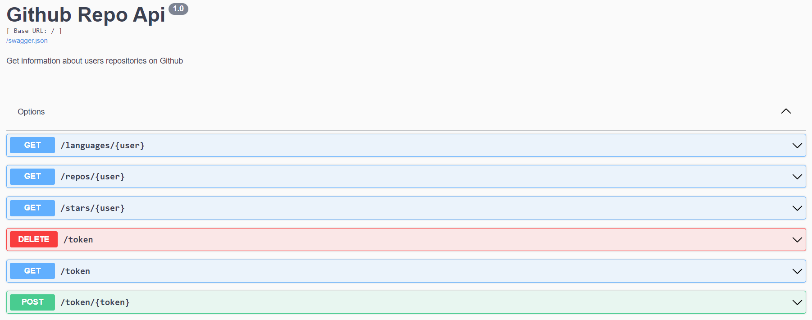

# GitHub Repositories API

## Contents
* [General](#general)
* [Setup](#setup)
  * [Using Docker](#using-docker)
  * [Manual setup using pip](#manual-setup-using-pip)
* [Requests](#requests)
  * [Examples of use](#examples-of-use)
* [Errors handlers](#errors-handlers)
* [Project structure](#project-structure)
* [Tests](#tests)
* [Technologies](#technologies)
* [Limits](#limits)
* [Improvement suggestions](#improvement-suggestions)

## General
The implementation of basic server using REST with Flask. To get information, I've used GithubApi.
Requests return:

* list of every repository,
* sum of stars in all repositories,
* most popular programing languages for given user.

API returns data in JSON format.

## Setup
### Using Docker
Clone repository
```
git clone https://github.com/Z-Rna/github-repo-api.git
```
Open directory 
```
cd github-repo-api
```
Build image and run container
```
docker-compose up -d --build
```
To kill container usage
```
docker-compose down
```
### Manual setup using pip

Clone repository
```
git clone https://github.com/Z-Rna/github-repo-api.git
```
Open directory 
```
cd github-repo-api
```
Install virtualenv
```
pip install virtualenv
```
Go to the project folder and create a virtual environment
```
python -m virtualenv venv
```
Active virtual environment
```
venv\Scripts\activate
```
Install modules
```
pip install -r requirements.txt
```
Run project
```
python app.py
```
## Requests
> By default server listen to port 5000 on localhost

App supports given endpoints:
* <code>GET /</code> - returns list of implemented endpoints,
* <code>GET /repos/{user}</code> - returns information about every repository of selected user (name, number of stars),
* <code>GET /stars/{user}</code> - return sum of stars in all repositories of selected user,
* <code>GET /languages/{user}</code> - return list of most popular programming languages of selected user (name, number of code bytes),
* <code>GET /token</code> - returns value of GitHub API token,
* <code>POST /token/{token}</code> - sets value of GitHub API token,
* <code>DELETE /token</code> - delete value of GitHub API token,
* <code>GET /api</code> - documentation in Swagger. Allows to send requests.

### Examples of use
GET http://127.0.0.1:5000/
```json
{
  "app info": "implemented endpoints",
  "endpoints": {
    "DELETE github token": {
      "endpoint": "http://127.0.0.1:5000/token",
      "method": "DELETE"
    },
    "GET github token": {
      "endpoint": "http://127.0.0.1:5000/token",
      "method": "GET"
    },
    "POST github token": {
      "endpoint": "http://127.0.0.1:5000/token/{token}",
      "method": "POST"
    },
    "count of stars for given user": {
      "endpoint": "http://127.0.0.1:5000/stars/{user}",
      "method": "GET"
    },
    "list of repositories for given user": {
      "endpoint": "http://127.0.0.1:5000/repos/{user}",
      "method": "GET"
    },
    "list of used languages in repositories": {
      "endpoint": "http://127.0.0.1:5000/languages/{user}",
      "method": "GET"
    },
    "swagger documentation": {
      "endpoint": "http://127.0.0.1:5000/api",
      "method": "GET"
    }
  }
}
```
GET http://127.0.0.1:5000/repos/z-rna
```json
{
  "repos": [
    {
      "name": "BAI-labo",
      "stars": 0
    },
    ...
    {
      "name": "PR",
      "stars": 1
    }
  ],
  "user": "z-rna"
}
```
GET http://127.0.0.1:5000/stars/z-rna
```json
{
  "all_stars": 2,
  "user": "z-rna"
}
```

GET http://127.0.0.1:5000/languages/z-rna
```json
{
  "languages": {
    "C++": 15107,
    "Java": 17605,
    "JavaScript": 229735,
    "Jupyter Notebook": 1368577,
    "Kotlin": 61029,
    "Python": 11224,
    "TeX": 8110
  },
  "user": "z-rna"
}
```

GET http://127.0.0.1:5000/token
```json
{
  "token": ""
}
```

POST http://127.0.0.1:5000/token/new_token
```json
{
  "info": "Posted token",
  "token": "new_token"
}
```

DELETE http://127.0.0.1:5000/token
```json
{
  "info": "Token deleted",
  "token": ""
}
```

GET http://127.0.0.1:5000/api


## Errors handlers
All errors' information are returns in JSON format for example: 

GET http://127.0.0.1:5000/wrong
```json
{
  "code": 404,
  "description": "The requested URL was not found on the server. If you entered the URL manually please check your spelling and try again.",
  "name": "Not Found",
  "source": "Server application: HTTP error"
}
```
There is three sources of errors:
* <b>Server application: HTTP error</b> - errors caused by HTTP protocol at local server: e.g. wrong endpoint,
* <b>Server application: python error</b> - errors caused by implementation: e.g. wrongly imported module,
* <b>GitHub API</b> - errors returned by GitHub API, e.g wrong user.
## Project structure
* <code>src/</code>
  * <code>Data.py</code> - class file for class Data,
  * <code>errorHandlers.py</code> - implementation of error handlers,
  * <code>GetData.py</code> - class file for class GetData,
  * <code>Languages.py</code> - class file for class Languages,
  * <code>route.py</code> - endpoints with usage functions,
  * <code>Stars.py</code> - class file for class Stars, 
* <code>test/</code>
  * <code>test_githubAPI_response.py</code> - set of test checking responses from Github API,
  * <code>test_server_HTTP_response.py</code> - set of test checking local endpoints, 
* <code>.env</code> - store environment variables,
* <code>app.py</code> - main file, execute Flask application,
* <code>docker-compose.yml</code> - file to configure application's services on Docker,
* <code>github-repo-api.dockerfile</code> - file used to build a Docker image, 
* <code>requirements.txt</code> - list of required packages that must be installed to run application.

## Tests 
Before testing start application.

To run test enter <code>test/</code> directory
```
cd test
```
Use python for seach and runing tests
```
python -m unittest discover
```

## Technologies

| Name        | Version |
|-------------|---------|
| Python      | 3.9     |
| Flask       | 2.0.2   |
| Flask-restx | 0.5.1   |
| Requests    | 2.27.1  |
| Werkzeug    | 2.0.2   |   

## Limits
* GitHub API responses are paged at size of 100, thus to get every repository of given user owing over 100 repositories, a couple of iterations are made,
* GitHub API allows for 60 API calls per hour,
* Post [OAuth](https://docs.github.com/en/rest/overview/other-authentication-methods#via-oauth-and-personal-access-tokens) token via <code>POST http://127.0.0.1:5000/token/new_token </code>to increase limit.

## Improvement suggestions
* add more unit tests,
* add continuous integration with GitHub repository ,
* add showing more information about repository, 
* add saving encrypted GitHub API and decrypted while user wants use it